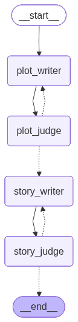

# Bedtime Story Agent

A LangGraph pipeline that turns a plain-language request into a calm bedtime story for children ages 5–10, with LLM judges that refine the outline and prose before anything is shown to the user.

**Model:** `gpt-3.5-turbo` (fixed per assignment). **Orchestration:** LangGraph. **Prompts:** Python templates in `prompts/templates.py`.

---

## Architecture



1. **request_safety**: (Pre-flight screen) is the request child-safe? Blocks horror, violence, adult themes, etc. Vague prompts like `"story"` or `"cat"` are allowed.
2. **plot_writer** → **plot_judge**: Writes a short outline (characters, setting, beats, ending), then scores `relevance` and `structure`. Failed judges loop back to the writer (capped at `MAX_PLOT_REVISIONS`).
3. **story_writer** → **story_judge**: Expands the approved outline into prose, then scores `age_appropriate` and `engagement`. Same revision pattern (`MAX_STORY_REVISIONS`).
4. **Output**: Final story text; scaffold tags (`[Beat N]`, `[S1]`…) from the writer are stripped in code before delivery.

Judges use **JSON mode** + Pydantic validation (with one retry). Pass = no dimension rated `bad` (`borderline` is OK).

---

## Project layout

| Path | Role |
|------|------|
| `agent/` | `StateGraph`, nodes, `StoryState`, `run_story()` |
| `prompts/` | System prompts and `strip_story_scaffolds()` |
| `bedtime_story_agent/` | OpenAI client, settings, optional LangSmith env setup, eval metrics |
| `tests/` | Integration eval (`tests/eval/prompts.py`, `test_eval.py`) |
| `scripts/visualizer.py` | Regenerate `docs/graph.mmd` and `docs/graph.png` |
| `scripts/push_prompts.py` | Push prompts to LangSmith Prompt Hub (optional) |
| `main.py` | CLI entry point |

---

## Design decisions

**Plan-then-write**: Outline first, prose second. Catches structural problems before tokens are spent on a full story.

**Two judge loops**: Plot quality and story quality are separate. A weak arc is fixed before writing; prose issues do not send you back to re-outline unless the plot judge already passed.

**good / borderline / bad**: Categorical rubrics are more stable on `gpt-3.5-turbo` than numeric 1–5 scores. The router only treats `bad` as failure.

**Safety node before plot_writer**: Inappropriate requests exit early with a clear message instead of burning revision budget or relying on downstream judges to salvage harmful prompts.

**Beat scaffolding + code strip**: The story writer emits `[Beat N]` / `[S1]–[S7]` structure; `prompts/scaffold.py` merges beats into paragraphs and removes tags so users see clean prose.

**@traceable on graph nodes**: LangSmith tracing when `LANGSMITH_TRACING=true`.

---

## Setup

Requires Python 3.11+ and [uv](https://github.com/astral-sh/uv) (or install deps from `pyproject.toml` another way).

```bash
uv sync --extra dev
cp .env.example .env
```

Set at minimum in `.env`:

```bash
OPENAI_API_KEY=sk-...
```

Optional LangSmith (tracing + `scripts/push_prompts.py`):

```bash
LANGSMITH_API_KEY=lsv2_...
LANGSMITH_TRACING=true
LANGSMITH_PROJECT=bedtime-story-agent
```

---

## How to run

**Interactive CLI** (prompts for a story request):

```bash
uv run python main.py
```

**Integration eval** (10 fixed prompts: standard, adversarial, minimal — not interactive; do not type at the terminal):

```bash
uv run pytest tests/test_eval.py -m integration -s
```

Writes `eval_results/eval_results.json` and prints a per-case summary line, e.g.  
`safe=✓  plot=✓  story=✓  words=793  grade=7.3  revisions=0p+0s  …`

**Regenerate architecture diagram:**

```bash
uv run python scripts/visualizer.py
```

---

## Eval (latest run)

Harness: `tests/eval/prompts.py` (10 cases). Metrics: plot/story judge pass flags, word count, Flesch–Kincaid grade via `textstat`, revision counts.

| Category | Cases | Safety | Full pipeline (plot + story) |
|----------|-------|--------|------------------------------|
| Standard | 4 | 4/4 allowed | 4/4 |
| Adversarial | 3 | 3/3 blocked | 0/3 (stopped at safety) |
| Minimal / vague | 3 | 3/3 allowed | 3/3 |

Avg. readability grade (completed stories): **~6.8**. Word counts ranged ~460–960 in this run; the writer prompt targets longer prose, but length is not strictly enforced in code.

Adversarial cases correctly never reached `plot_writer`. After tightening the safety prompt, minimal cases (`"story"`, `"cat"`, `"something nice for bedtime"`) are allowed rather than rejected for being underspecified.

---

## Known limitations

- **Story length and beat structure**: The writer prompt asks for one paragraph per outline beat (5–7 sentences each), but the model often merges beats or undershoots word targets; judges do not check paragraph count or length. (Scaffolding helps curb this limitation)
- **Readability grades**: FK grade can drift above an ideal “read aloud” band (~4–6) on richer vocabulary.
- **Safety is LLM-based**: Deterministic blocklists and a stricter second gate were skipped in favor of a single simple safety prompt.

---

## What I'd build next

From `main.py`:

> The most exciting extension would be a choose-your-own-adventure mode inspired by the Goosebumps gamebook series I used to read as a kid: grow the plot-writer into a branching outliner with decision paths and convergent safe endings, letting the child co-author the story beat by beat.

Other high-value follow-ups: per-beat story generation (one API call per outline beat) for reliable structure, deterministic length/readability checks in the story-judge loop, and stronger bedtime-tone rubric dimensions.
